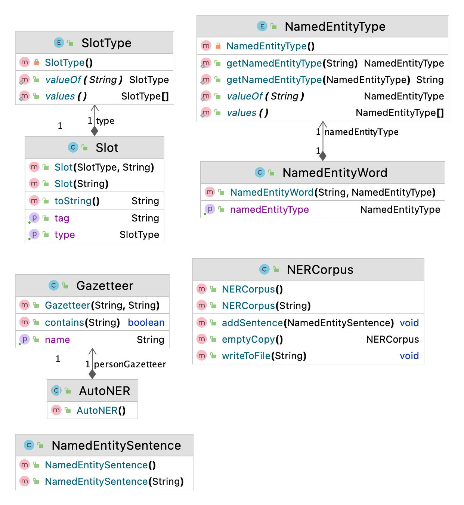

Named Entity Recognition Task
============

In named entity recognition, one tries to find the strings within a text that correspond to proper names (excluding TIME and MONEY) and classify the type of entity denoted by these strings. The problem is difficult partly due to the ambiguity in sentence segmentation; one needs to extract which words belong to a named entity, and which not. Another difficulty occurs when some word may be used as a name of either a person, an organization or a location. For example, Deniz may be used as the name of a person, or - within a compound - it can refer to a location Marmara Denizi 'Marmara Sea', or an organization Deniz Taşımacılık 'Deniz Transportation'.

The standard approach for NER is a word-by-word classification, where the classifier is trained to label the words in the text with tags that indicate the presence of particular kinds of named entities. After giving the class labels (named entity tags) to our training data, the next step is to select a group of features to discriminate different named entities for each input word.

[<sub>ORG</sub> Türk Hava Yolları] bu [<sub>TIME</sub> Pazartesi'den] itibaren [<sub>LOC</sub> İstanbul] [<sub>LOC</sub> Ankara] hattı için indirimli satışlarını [<sub>MONEY</sub> 90 TL'den] başlatacağını açıkladı.

[<sub>ORG</sub> Turkish Airlines] announced that from this [<sub>TIME</sub> Monday] on it will start its discounted fares of [<sub>MONEY</sub> 90TL] for [<sub>LOC</sub> İstanbul] [<sub>LOC</sub> Ankara] route.

See the Table below for typical generic named entity types.

|Tag|Sample Categories|
|---|---|
|PERSON|people, characters|
|ORGANIZATION|companies, teams|
|LOCATION|regions, mountains, seas|
|TIME|time expressions|
|MONEY|monetarial expressions|

Video Lectures 
============

[](https://youtu.be/tuuc5W5oNPw)

Class Diagram
============



For Developers
============
You can also see [Python](https://github.com/starlangsoftware/TurkishNamedEntityRecognition-Py), [Cython](https://github.com/starlangsoftware/TurkishNamedEntityRecognition-Cy), [C](https://github.com/starlangsoftware/TurkishNamedEntityRecognition-C), [C++](https://github.com/starlangsoftware/TurkishNamedEntityRecognition-CPP), [Swift](https://github.com/starlangsoftware/TurkishNamedEntityRecognition-Swift), [Js](https://github.com/starlangsoftware/TurkishNamedEntityRecognition-Js), or [C#](https://github.com/starlangsoftware/TurkishNamedEntityRecognition-CS) repository.

## Requirements

* [Java Development Kit 8 or higher](#java), Open JDK or Oracle JDK
* [Maven](#maven)
* [Git](#git)

### Java 

To check if you have a compatible version of Java installed, use the following command:

    java -version
    
If you don't have a compatible version, you can download either [Oracle JDK](https://www.oracle.com/technetwork/java/javase/downloads/jdk8-downloads-2133151.html) or [OpenJDK](https://openjdk.java.net/install/)    

### Maven
To check if you have Maven installed, use the following command:

    mvn --version
    
To install Maven, you can follow the instructions [here](https://maven.apache.org/install.html).      

### Git

Install the [latest version of Git](https://git-scm.com/book/en/v2/Getting-Started-Installing-Git).

## Download Code

In order to work on code, create a fork from GitHub page. 
Use Git for cloning the code to your local or below line for Ubuntu:

	git clone <your-fork-git-link>

A directory called NamedEntityRecognition will be created. Or you can use below link for exploring the code:

	git clone https://github.com/starlangsoftware/TurkishNamedEntityRecognition.git

## Open project with IntelliJ IDEA

Steps for opening the cloned project:

* Start IDE
* Select **File | Open** from main menu
* Choose `NamedEntityRecognition/pom.xml` file
* Select open as project option
* Couple of seconds, dependencies with Maven will be downloaded. 


## Compile

**From IDE**

After being done with the downloading and Maven indexing, select **Build Project** option from **Build** menu. After compilation process, user can run NamedEntityRecognition.

**From Console**

Go to `NamedEntityRecognition` directory and compile with 

     mvn compile 

## Generating jar files

**From IDE**

Use `package` of 'Lifecycle' from maven window on the right and from `NamedEntityRecognition` root module.

**From Console**

Use below line to generate jar file:

     mvn install

## Maven Usage

        <dependency>
            <groupId>io.github.starlangsoftware</groupId>
            <artifactId>NamedEntityRecognition</artifactId>
            <version>1.0.11</version>
        </dependency>

------------------------------------------------

Detailed Description
============
+ [Gazetteer](#gazetteer)

## Gazetteer

Bir Gazetter yüklemek için

	Gazetteer(String name, String fileName)

Hazır Gazetteerleri kullanmak için

	AutoNER()

Bir Gazetteer'de bir kelime var mı diye kontrol etmek için

	boolean contains(String word)

# Cite

	@INPROCEEDINGS{8093439,
  	author={B. {Ertopçu} and A. B. {Kanburoğlu} and O. {Topsakal} and O. {Açıkgöz} and A. T. {Gürkan} and B. {Özenç} and İ. {Çam} and B. {Avar} and G. {Ercan} 	and O. T. {Yıldız}},
  	booktitle={2017 International Conference on Computer Science and Engineering (UBMK)}, 
  	title={A new approach for named entity recognition}, 
  	year={2017},
  	volume={},
  	number={},
  	pages={474-479},
  	doi={10.1109/UBMK.2017.8093439}}

For Contibutors
============

### pom.xml file
1. Standard setup for packaging is similar to:
```
    <groupId>io.github.starlangsoftware</groupId>
    <artifactId>Amr</artifactId>
    <version>1.0.0</version>
    <packaging>jar</packaging>
    <name>NlpToolkit.Amr</name>
    <description>Abstract Meaning Representation Library</description>
    <url>https://github.com/StarlangSoftware/Amr</url>

    <organization>
        <name>io.github.starlangsoftware</name>
        <url>https://github.com/starlangsoftware</url>
    </organization>

    <licenses>
        <license>
            <name>The Apache Software License, Version 2.0</name>
            <url>http://www.apache.org/licenses/LICENSE-2.0.txt</url>
        </license>
    </licenses>

    <developers>
        <developer>
            <name>Olcay Taner Yildiz</name>
            <email>olcay.yildiz@ozyegin.edu.tr</email>
            <organization>Starlang Software</organization>
            <organizationUrl>http://www.starlangyazilim.com</organizationUrl>
        </developer>
    </developers>

    <scm>
        <connection>scm:git:git://github.com/starlangsoftware/amr.git</connection>
        <developerConnection>scm:git:ssh://github.com:starlangsoftware/amr.git</developerConnection>
        <url>http://github.com/starlangsoftware/amr/tree/master</url>
    </scm>

    <properties>
        <maven.compiler.source>1.8</maven.compiler.source>
        <maven.compiler.target>1.8</maven.compiler.target>
        <project.build.sourceEncoding>UTF-8</project.build.sourceEncoding>
    </properties>
```
2. Only top level dependencies should be added. Do not forget junit dependency.
```
    <dependencies>
        <dependency>
            <groupId>io.github.starlangsoftware</groupId>
            <artifactId>AnnotatedSentence</artifactId>
            <version>1.0.78</version>
        </dependency>
        <dependency>
            <groupId>junit</groupId>
            <artifactId>junit</artifactId>
            <version>4.13.1</version>
            <scope>test</scope>
        </dependency>
    </dependencies>
```
3. Maven compiler, gpg, source, javadoc plugings should be added.
```
	<plugin>
		<groupId>org.apache.maven.plugins</groupId>
		<artifactId>maven-compiler-plugin</artifactId>
		<version>3.6.1</version>
		<configuration>
			<source>1.8</source>
			<target>1.8</target>
		</configuration>
	</plugin>
	<plugin>
		<groupId>org.apache.maven.plugins</groupId>
		<artifactId>maven-gpg-plugin</artifactId>
		<version>1.6</version>
		<executions>
			<execution>
				<id>sign-artifacts</id>
				<phase>verify</phase>
				<goals>
					<goal>sign</goal>
				</goals>
			</execution>
		</executions>
	</plugin>
	<plugin>
		<groupId>org.apache.maven.plugins</groupId>
		<artifactId>maven-source-plugin</artifactId>
		<version>2.2.1</version>
		<executions>
			<execution>
				<id>attach-sources</id>
				<goals>
					<goal>jar-no-fork</goal>
				</goals>
			</execution>
		</executions>
	</plugin>
	<plugin>
		<groupId>org.apache.maven.plugins</groupId>
		<artifactId>maven-javadoc-plugin</artifactId>
		<configuration>
			<source>8</source>
		</configuration>
		<version>3.10.0</version>
		<executions>
			<execution>
				<id>attach-javadocs</id>
				<goals>
					<goal>jar</goal>
				</goals>
			</execution>
		</executions>
	</plugin>
```
4. Currently publishing plugin is Sonatype.
```
	<plugin>
		<groupId>org.sonatype.central</groupId>
		<artifactId>central-publishing-maven-plugin</artifactId>
		<version>0.8.0</version>
		<extensions>true</extensions>
		<configuration>
			<publishingServerId>central</publishingServerId>
			<autoPublish>true</autoPublish>
		</configuration>
	</plugin>
```
5. For UI jar files use assembly plugins.
```
	<plugin>
		<groupId>org.apache.maven.plugins</groupId>
		<artifactId>maven-assembly-plugin</artifactId>
		<version>2.2-beta-5</version>
		<executions>
			<execution>
				<id>sentence-dependency</id>
				<phase>package</phase>
				<goals>
					<goal>single</goal>
				</goals>
				<configuration>
					<archive>
						<manifest>
							<mainClass>Amr.Annotation.TestAmrFrame</mainClass>
						</manifest>
					</archive>
					<finalName>amr</finalName>
				</configuration>
			</execution>
		</executions>
		<configuration>
			<descriptorRefs>
				<descriptorRef>jar-with-dependencies</descriptorRef>
			</descriptorRefs>
			<appendAssemblyId>false</appendAssemblyId>
		</configuration>
	</plugin>
```
### Resources
1. Add resources to the resources subdirectory. These will include image files (necessary for UI), data files, etc.
   
### Java files
1. Do not forget to comment each function.
```
    /**
     * Returns the value of a given layer.
     * @param viewLayerType Layer for which the value questioned.
     * @return The value of the given layer.
     */
    public String getLayerInfo(ViewLayerType viewLayerType){
```
2. Function names should follow caml case.
```
    public MorphologicalParse getParse()
```
3. Write toString methods, if necessary.
4. Use Junit for writing test classes. Use test setup if necessary.
```
public class AnnotatedSentenceTest {
    AnnotatedSentence sentence0, sentence1, sentence2, sentence3, sentence4;
    AnnotatedSentence sentence5, sentence6, sentence7, sentence8, sentence9;

    @Before
    public void setUp() throws Exception {
        sentence0 = new AnnotatedSentence(new File("sentences/0000.dev"));
```
